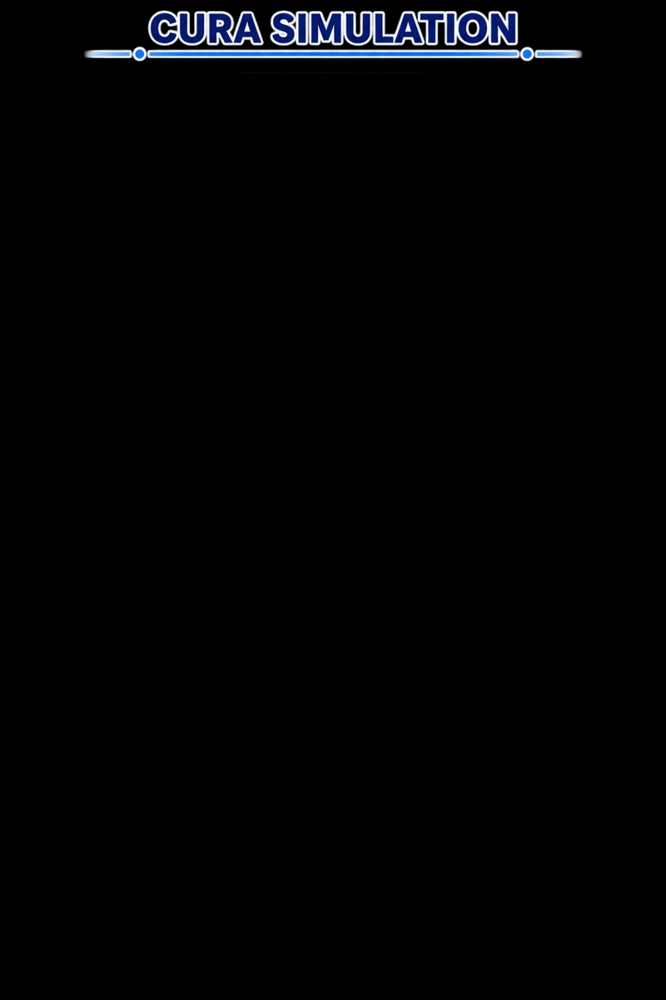
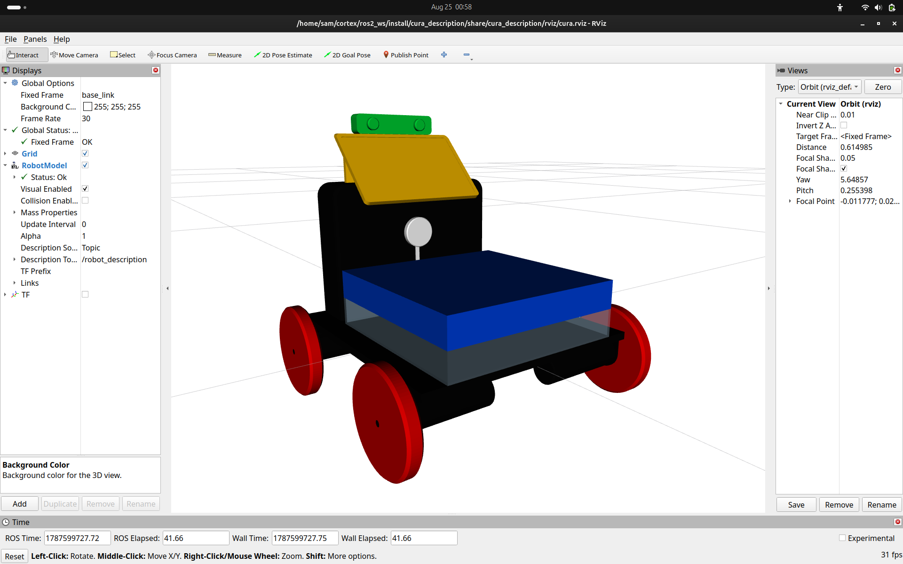
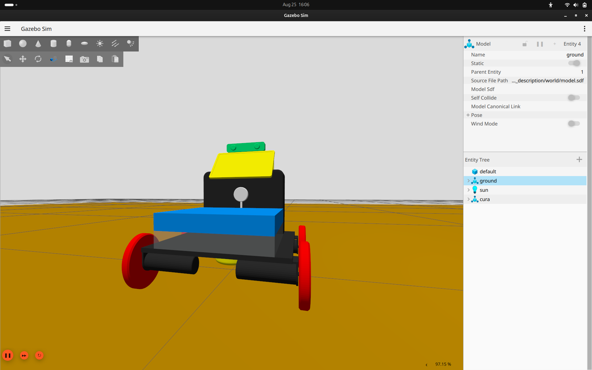
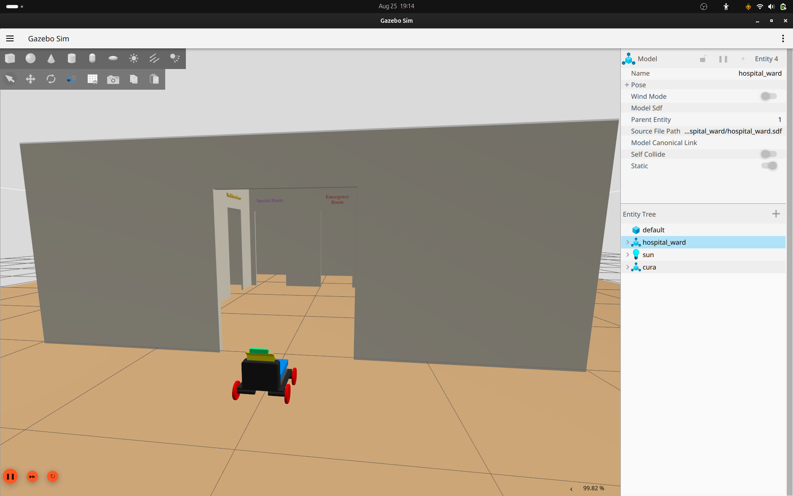

<div align="center">

# 🏥 Cura — Medical Component Transport Robot

A complete **ROS 2 Jazzy** and **Gazebo Harmonic** simulation of **Cura**, a compact medical assistance robot designed for hospital environments.

The simulation integrates a four-wheel differential-drive platform with **LiDAR, RGB camera, IMU, SLAM, localization, autonomous navigation, and a custom hospital ward environment**.

---

### 🎥 Project Demonstration

<a href="assets/videos/cura.gif">
  
</a>

Click the GIF above to view the Cura simulation demonstration.

</div>

---

# 📖 Overview

**Cura** is a hospital-oriented mobile robot developed by **Team Cortex**. This repository contains the simulation branch used to develop and validate Cura's mobility, perception, mapping, localization, and navigation stack.

The project is organized as a ROS 2 workspace containing four main packages:

- `cura_description` — robot model, sensors, Gazebo integration, hospital world, RViz configuration, and simulation launch files
- `cura_control` — differential-drive controller configuration
- `cura_slam` — SLAM Toolbox and Cartographer configurations/launch files
- `cura_nav` — Nav2 localization and autonomous navigation configuration

The current simulation is built around:

- **ROS 2 Jazzy**
- **Gazebo Harmonic / Gazebo Sim**
- **RViz2**
- **SLAM Toolbox**
- **Nav2**
- **robot_localization EKF**
- **ROS–Gazebo topic bridging**

This provides the foundation for developing a larger hospital-assistance and humanoid/bionic robotics research platform.

---

# 🤖 Cura Robot

<div align="center">

| Cura in RViz | Cura in Gazebo |
|:---:|:---:|
|  |  |

</div>

### Robot Structure

Cura uses a four-wheel differential-drive configuration with:

- `base_footprint`
- `base_link`
- Front-left and front-right wheels
- Rear-left and rear-right wheels
- LiDAR
- RGB camera
- IMU
- HMI module
- Storage module
- Transparent sanitation tank
- Ultrasonic humidifier

The robot geometry is defined using **Xacro/URDF**, with visual and collision meshes stored as STL files.

---

# 🧩 Robot Sensors

Cura's simulated perception stack contains three primary sensors.

### 🔵 LiDAR

The Gazebo LiDAR publishes to:

```text
/scan
```

Configuration:

- GPU LiDAR
- 360 horizontal samples
- 360° scan
- Update rate: **30 Hz**
- Minimum range: **0.3 m**
- Maximum range: **12 m**

The LiDAR is used by both **SLAM Toolbox** and the **Nav2 costmaps**.

### 🟢 RGB Camera

The camera publishes:

```text
/camera/image_raw
```

Configuration:

- Resolution: **640 × 480**
- RGB image
- Update rate: **30 Hz**
- Horizontal FOV: approximately **60°**

### 🟡 IMU

The IMU publishes:

```text
/imu
```

Configuration:

- Update rate: **50 Hz**
- Used by the `robot_localization` EKF for yaw and yaw velocity estimation

---

# ⚙️ Robot Motion and Odometry

Cura uses a **four-wheel differential-drive** configuration.

The Gazebo `DiffDrive` system controls:

```text
Front Left
Rear Left
Front Right
Rear Right
```

with:

- Wheel separation: **0.2685 m**
- Wheel radius: **0.05 m**
- Maximum linear acceleration: **1.0 m/s²**
- Maximum angular acceleration: **2.0 rad/s²**
- Odometry update frequency: **50 Hz**

The main command interface is:

```text
/cmd_vel
```

Odometry is published on:

```text
/odom
```

> **Implementation note:** `cura_control/config/controllers.yaml` contains a ROS 2 Control `diff_drive_controller` configuration, but the current Gazebo simulation directly uses the Gazebo `gz-sim-diff-drive-system` plugin defined in `cura_description/urdf/gazebo.xacro`.

---

# 🌍 Hospital Ward Simulation

Cura is simulated inside a custom hospital ward environment.

<div align="center">



</div>

The world is defined in:

```text
cura_description/hospital_ward/hospital_ward.sdf
```

The environment contains separate meshes for:

- Hospital walls
- Floor
- Roof
- Emergency room
- Quarantine room
- Special room
- Medicine center
- Nurse station
- Toilet
- Additional environment markers

The roof is configured as a transparent visual element so the robot and navigation behaviour can be observed from above while the physical collision geometry remains available to Gazebo.

---

# 🗺️ SLAM

Cura supports real-time mapping using **SLAM Toolbox**.

The primary SLAM launch file is:

```text
cura_slam/launch/online_async_launch.py
```

The SLAM configuration is:

```text
cura_slam/config/mapper_params_online_async.yaml
```

### SLAM Configuration

The current configuration uses:

- `slam_toolbox`
- Asynchronous SLAM
- 2D laser scan matching
- `/scan` as the laser input
- `map` as the global frame
- `odom` as the odometry frame
- `base_link` as the robot frame
- Map resolution: **0.05 m**
- Loop closure enabled
- Scan matching enabled
- Interactive mode enabled

### Launch SLAM

Start the simulation first:

```bash
ros2 launch cura_description sim.launch.py
```

Then start SLAM:

```bash
ros2 launch cura_slam online_async_launch.py
```

The resulting occupancy grid can be visualized in RViz2.

---

# 🧭 Autonomous Navigation

Cura includes a custom **Nav2** navigation package:

```text
cura_nav
```

The navigation stack contains configuration for:

- Controller Server
- Planner Server
- Smoother Server
- Behavior Server
- BT Navigator
- Waypoint Follower
- Route Server
- Docking Server
- AMCL localization
- Global Costmap
- Local Costmap
- Lifecycle Manager

---

## 🎯 Nav2 Controller

The configured local controller is:

```text
nav2_mppi_controller::MPPIController
```

The controller is configured for a:

```text
DiffDrive
```

motion model.

Important parameters include:

- Maximum forward velocity: **0.5 m/s**
- Minimum forward velocity: **-0.35 m/s**
- Maximum angular velocity: **1.9 rad/s**
- Controller frequency: **20 Hz**
- Goal position tolerance: **0.25 m**
- Goal yaw tolerance: **0.25 rad**

---

## 🧱 Costmaps

### Local Costmap

The local costmap uses:

- `odom` as the global frame
- `base_link` as the robot frame
- Rolling window
- Size: **3 m × 3 m**
- Resolution: **0.05 m**
- Robot radius: **0.22 m**
- LiDAR obstacle layer
- Inflation layer

### Global Costmap

The global costmap uses:

- `map` as the global frame
- `base_link` as the robot frame
- Resolution: **0.05 m**
- Robot radius: **0.22 m**
- Static layer
- LiDAR obstacle layer
- Inflation layer

Both costmaps consume:

```text
/scan
```

for obstacle detection.

---

# 📍 Localization

The repository contains an AMCL-based localization launch file:

```text
cura_nav/launch/localization_launch.py
```

Localization is intended to use:

```text
map
odom
base_link
```

and the Nav2 AMCL stack.

A previously generated map must be supplied through the `map:=` launch argument.

> **Note:** The current repository does not contain a saved `.yaml` map file. Generate and save a map with SLAM Toolbox before using the AMCL localization workflow.

---

# 🔄 Sensor Fusion

Cura includes a `robot_localization` EKF configuration:

```text
cura_description/config/ekf.yaml
```

The EKF combines:

```text
/odom
/imu
```

The current configuration:

- Uses 2D mode
- Publishes TF
- Uses `odom` as the world frame
- Uses `base_footprint` as the robot base frame
- Uses forward linear velocity from wheel odometry
- Uses yaw and yaw velocity from the IMU

This reduces the effect of wheel-slip-related heading errors during simulation.

---

# 🌉 ROS 2 ↔ Gazebo Bridge

The ROS–Gazebo interface is configured in:

```text
cura_description/config/bridge_config.yaml
```

The bridge handles:

| ROS 2 Topic | Gazebo Topic | Direction |
|---|---|---|
| `/clock` | `/clock` | Gazebo → ROS 2 |
| `/joint_states` | `/joint_states` | Gazebo → ROS 2 |
| `/odom` | `/odom` | Gazebo → ROS 2 |
| `/cmd_vel` | `/cmd_vel` | ROS 2 → Gazebo |
| `/scan` | `/scan` | Gazebo → ROS 2 |
| `/camera/image_raw` | `/camera/image_raw` | Gazebo → ROS 2 |
| `/imu` | `/imu` | Gazebo → ROS 2 |

This allows ROS 2 navigation and perception nodes to operate directly on the Gazebo simulation data.

---

# 🖥️ RViz

The RViz configuration is stored at:

```text
cura_description/rviz/cura.rviz
```

It provides visualization of the robot and its ROS 2 data, including:

- Robot model
- TF
- LaserScan
- Map
- Odometry
- Navigation data

For a model-only visualization:

```bash
ros2 launch cura_description display.launch.py
```

---

# ⚙️ Requirements

The simulation is intended for:

- Ubuntu 24.04
- ROS 2 Jazzy
- Gazebo Harmonic / Gazebo Sim
- RViz2
- Python 3
- `colcon`
- `xacro`
- `ros_gz_sim`
- `ros_gz_bridge`
- `robot_localization`
- `slam_toolbox`
- Nav2
- `nav2_mppi_controller`
- `opennav_docking`

Install the ROS dependencies required by the workspace with:

```bash
rosdep install --from-paths src --ignore-src -r -y
```

---

# 🚀 Getting Started

## 1. Clone the Repository

```bash
git clone <repository-url>
cd cortex-feature-simulation
```

## 2. Enter the ROS 2 Workspace

```bash
cd ros2_ws
```

## 3. Install Dependencies

```bash
rosdep install --from-paths src --ignore-src -r -y
```

## 4. Build the Workspace

```bash
colcon build --symlink-install
```

## 5. Source the Workspace

```bash
source install/setup.bash
```

---

# ▶️ Launch the Cura Simulation

The main simulation launch file starts:

- Gazebo
- Hospital ward
- Cura robot
- Robot State Publisher
- ROS–Gazebo bridge
- Robot Localization EKF
- RViz2

Run:

```bash
ros2 launch cura_description sim.launch.py
```

Cura is spawned at the hospital entrance at approximately:

```text
x = 0.0
y = -2.5
z = 0.1
yaw = 1.5708 rad
```

The robot therefore starts facing into the hospital environment.

---

# 🎮 Teleoperate Cura

Use the standard ROS 2 keyboard teleoperation node:

```bash
ros2 run teleop_twist_keyboard teleop_twist_keyboard
```

The teleoperation node publishes velocity commands to:

```text
/cmd_vel
```

which are consumed by the Gazebo differential-drive system.

---

# 🗺️ Mapping Workflow

A typical mapping workflow is:

### Terminal 1 — Simulation

```bash
cd ~/cortex-feature-simulation/ros2_ws
source install/setup.bash

ros2 launch cura_description sim.launch.py
```

### Terminal 2 — SLAM

```bash
source install/setup.bash

ros2 launch cura_slam online_async_launch.py
```

### Terminal 3 — Teleoperation

```bash
source install/setup.bash

ros2 run teleop_twist_keyboard teleop_twist_keyboard
```

Drive Cura through the hospital ward while observing the generated map in RViz.

---

# 🧭 Navigation Workflow

After creating and saving a map, launch the navigation stack with the custom parameter file:

```bash
ros2 launch cura_nav navigation_launch.py \
  params_file:=$(ros2 pkg prefix cura_nav)/share/cura_nav/config/nav2_params.yaml \
  use_sim_time:=true \
  autostart:=true
```

For localization with a saved map:

```bash
ros2 launch cura_nav localization_launch.py \
  map:=/path/to/your/map.yaml \
  params_file:=$(ros2 pkg prefix cura_nav)/share/cura_nav/config/nav2_params.yaml \
  use_sim_time:=true \
  autostart:=true
```

Then use RViz2 to send a **2D Goal Pose**.

---

# 📦 ROS 2 Package Structure

## `cura_description`

Responsible for the robot model and simulation environment.

Contains:

- URDF/Xacro
- STL meshes
- Gazebo configuration
- Sensors
- Hospital ward world
- RViz configuration
- Simulation launch files
- ROS–Gazebo bridge configuration
- EKF configuration

---

## `cura_control`

Contains the ROS 2 Control configuration:

```text
config/controllers.yaml
```

The configuration defines:

- Joint State Broadcaster
- Differential Drive Controller
- Wheel names
- Wheel separation
- Wheel radius
- Velocity limits
- Odometry settings

---

## `cura_slam`

Contains the mapping stack.

### SLAM Toolbox

```text
config/mapper_params_online_async.yaml
launch/online_async_launch.py
```

### Cartographer

```text
config/slam.lua
launch/cartographer.launch.py
```

> **Important:** `cartographer.launch.py` currently references the package name `bot_slam`, which is not present in this repository. Treat this file as an existing/experimental Cartographer configuration rather than the primary supported SLAM launch path. The supported mapping workflow in this branch is **SLAM Toolbox**.

---

## `cura_nav`

Contains the autonomous navigation stack.

### Navigation

```text
launch/navigation_launch.py
```

### Localization

```text
launch/localization_launch.py
```

### Parameters

```text
config/nav2_params.yaml
```

The navigation configuration includes MPPI control, costmaps, planning, behaviors, waypoint following, routing, and docking.

---

# 📁 Repository Structure

```text
cortex-feature-simulation/
├── .github/
│   └── workflows/
│       └── ci.yml
│
├── assets/
│   ├── images/
│   │   ├── cura_gazebo.png
│   │   ├── cura_rviz.png
│   │   └── cura_world.png
│   │
│   └── videos/
│       ├── cura.gif
│       └── ReadME.md
│
├── ros2_ws/
│   └── src/
│       │
│       ├── cura_description/
│       │   ├── config/
│       │   │   ├── bridge_config.yaml
│       │   │   └── ekf.yaml
│       │   │
│       │   ├── hospital_ward/
│       │   │   ├── hospital_ward.sdf
│       │   │   ├── model.config
│       │   │   └── meshes/
│       │   │       ├── emergency_room.stl
│       │   │       ├── floor.stl
│       │   │       ├── medicine_center.stl
│       │   │       ├── nurse_station.stl
│       │   │       ├── plus.stl
│       │   │       ├── quarantine_room.stl
│       │   │       ├── roof.stl
│       │   │       ├── special_room.stl
│       │   │       ├── toilet.stl
│       │   │       └── walls.stl
│       │   │
│       │   ├── launch/
│       │   │   ├── display.launch.py
│       │   │   └── sim.launch.py
│       │   │
│       │   ├── meshes/
│       │   │   ├── base_link.stl
│       │   │   ├── camera_link.stl
│       │   │   ├── f_wheel_l.stl
│       │   │   ├── f_wheel_r.stl
│       │   │   ├── b_wheel_l.stl
│       │   │   ├── b_wheel_r.stl
│       │   │   ├── hmi.stl
│       │   │   ├── lidar_link.stl
│       │   │   ├── sanitation_tank.stl
│       │   │   ├── storage_link.stl
│       │   │   └── ultrasonic_humidifier.stl
│       │   │
│       │   ├── rviz/
│       │   │   └── cura.rviz
│       │   │
│       │   └── urdf/
│       │       ├── cura.urdf
│       │       ├── cura.xacro
│       │       ├── gazebo.xacro
│       │       └── materials.xacro
│       │
│       ├── cura_control/
│       │   ├── config/
│       │   │   └── controllers.yaml
│       │   ├── CMakeLists.txt
│       │   └── package.xml
│       │
│       ├── cura_slam/
│       │   ├── config/
│       │   │   ├── mapper_params_online_async.yaml
│       │   │   └── slam.lua
│       │   ├── launch/
│       │   │   ├── online_async_launch.py
│       │   │   └── cartographer.launch.py
│       │   ├── CMakeLists.txt
│       │   └── package.xml
│       │
│       └── cura_nav/
│           ├── config/
│           │   └── nav2_params.yaml
│           ├── launch/
│           │   ├── localization_launch.py
│           │   └── navigation_launch.py
│           ├── CMakeLists.txt
│           └── package.xml
│
├── .gitignore
├── README.md
```

---

# 🔗 Main ROS 2 Data Flow

```text
                         ┌──────────────────┐
                         │  Gazebo Harmonic │
                         └────────┬─────────┘
                                  │
             ┌────────────────────┼────────────────────┐
             │                    │                    │
          /scan             /camera/image_raw        /imu
             │                    │                    │
             ▼                    ▼                    ▼
      ┌────────────┐       ┌────────────┐       ┌─────────────┐
      │    SLAM    │       │   Vision   │       │ Robot       │
      │   Toolbox  │       │  Pipeline  │       │ Localization│
      └─────┬──────┘       └────────────┘       └──────┬──────┘
            │                                           │
            ▼                                           ▼
         /map                                      odom → base
            │                                           │
            └──────────────────┬────────────────────────┘
                               ▼
                        ┌──────────────┐
                        │    Nav2      │
                        │              │
                        │ Planner      │
                        │ Controller   │
                        │ Costmaps     │
                        │ Behaviors    │
                        └──────┬───────┘
                               │
                               ▼
                           /cmd_vel
                               │
                               ▼
                     ┌──────────────────┐
                     │ Gazebo DiffDrive │
                     └──────────────────┘
```

---

# 🧪 Continuous Integration

GitHub Actions configuration is provided at:

```text
.github/workflows/ci.yml
```

The workflow is intended to:

1. Run on Ubuntu 24.04
2. Use a ROS 2 Jazzy container
3. Check out the repository
4. Install dependencies with `rosdep`
5. Build the workspace
6. Run `colcon test`

---

# ✅ Current Capabilities

- ✔️ Four-wheel differential-drive robot
- ✔️ Cura robot URDF/Xacro model
- ✔️ Gazebo Harmonic simulation
- ✔️ Custom hospital ward environment
- ✔️ Transparent hospital roof visualization
- ✔️ LiDAR simulation
- ✔️ RGB camera simulation
- ✔️ IMU simulation
- ✔️ ROS–Gazebo topic bridging
- ✔️ Wheel odometry
- ✔️ EKF sensor fusion
- ✔️ RViz2 visualization
- ✔️ SLAM Toolbox mapping
- ✔️ Occupancy grid generation
- ✔️ Nav2 navigation configuration
- ✔️ MPPI local control
- ✔️ Local and global costmaps
- ✔️ AMCL localization workflow
- ✔️ Waypoint following
- ✔️ Route server configuration
- ✔️ Docking server configuration
- ✔️ GitHub Actions CI configuration

---

# 🎯 Future Development

The simulation provides a foundation for the next stages of Cura development.

### Robotics

- Improve wheel-slip modelling
- Tune odometry and EKF fusion
- Add more realistic actuator dynamics
- Validate navigation under dynamic obstacles

### Perception

- Computer vision pipeline
- Object detection
- Human detection and tracking
- Medical-object recognition
- Barcode/QR medication verification
- Depth perception

### Hospital Assistance

- Medicine transportation
- Patient-room navigation
- Contaminated-zone avoidance
- Autonomous docking
- Hospital waypoint missions
- Task-level autonomy

### Bionics & Humanoids Research

The current mobile platform can serve as a base for more advanced **bionic and humanoid robotics research**, particularly in:

- Human–robot interaction
- Multimodal perception
- Autonomous manipulation
- Assistive robotics
- Mobile manipulation
- Vision-guided manipulation
- Human-aware navigation

The long-term direction is to evolve Cura from a mobile simulation platform toward a more capable **hospital-assistance robotic system**.

---

# 🤝 Contributions

Contributions, improvements, bug fixes, and feature suggestions are welcome.

When contributing:

1. Keep ROS 2 packages modular.
2. Document new launch files and parameters.
3. Test simulation changes in Gazebo and RViz.
4. Keep robot and world assets organized inside their respective packages.
5. Update this README when adding major functionality.

---

<div align="center">

### 🏥 Team Cortex

**Cura — Medical Component Transport Robot**

Built with ❤️ using **ROS 2 + Gazebo + Nav2 + SLAM Toolbox**

</div>
